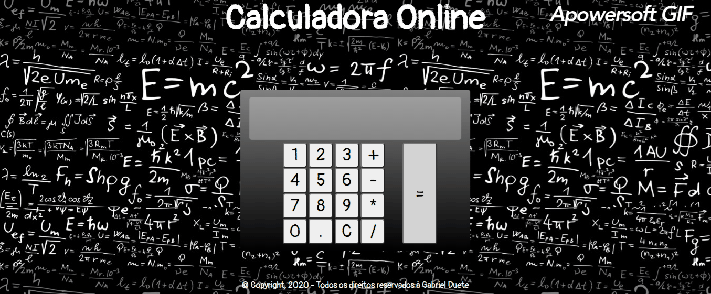

<h1 align='center'>
    Calculadora Simples
</h1>

# ⏩Prévia

# 📝 Sobre

Uma calculadora simples na web, desenvolvida no intuito de praticar minhas habilidades de HTML5, CSS3 e JavaScript.

# 💻 Tecnologias Usadas

- [CSS3]()
- [HTML5]()
- [JavaScript]()
- [Media Queres]()

# ▶ Como acessar

Acesse esse link : https://gabrielduete.github.io/calculadora_simples/
